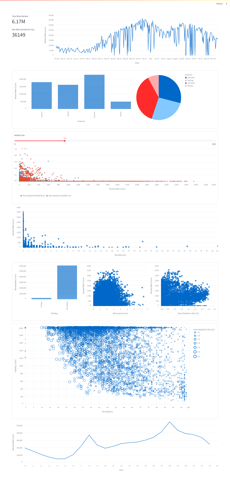

## Streamlit Dashboard for seoulbike dataset

[Report](./assets/Report.pdf)
```bash
# dependency: streamlit, millify
pip install -r requirements.txt
```

```bash
streamlit run main.py
# Opens http://localhost:8501/ url in the browser
```
